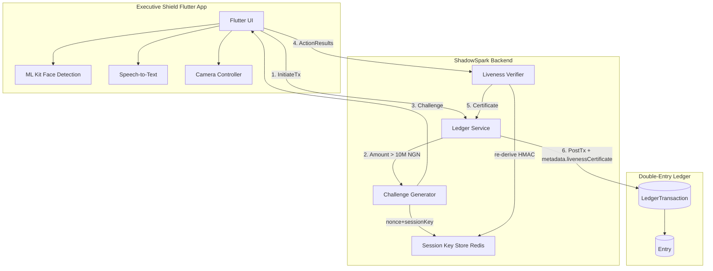
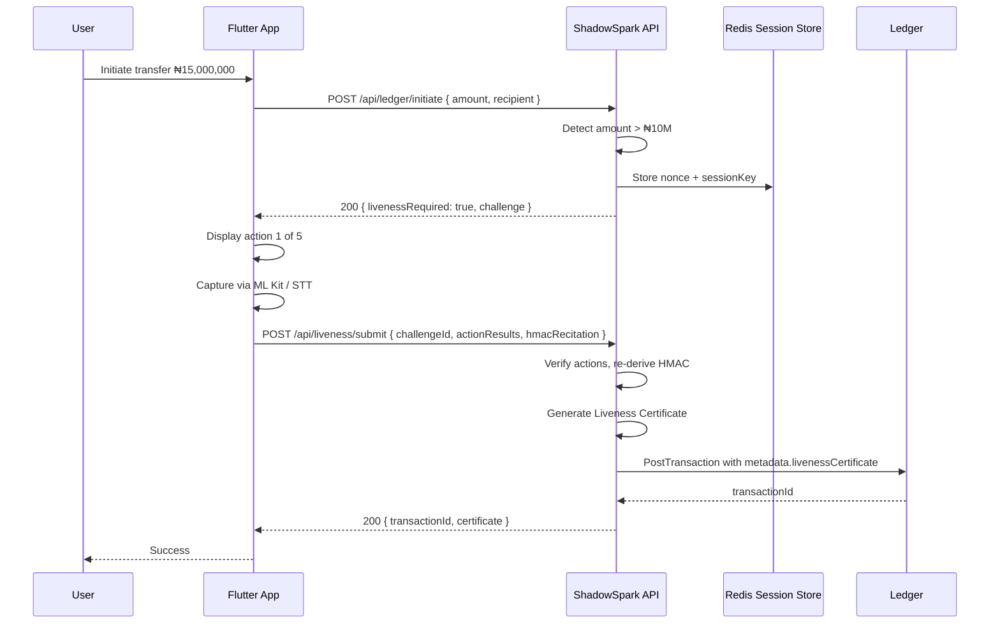
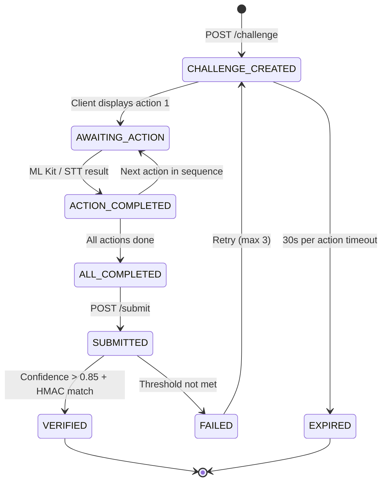

# Anti-Deepfake Handshake: Challenge-Response Liveness Protocol

> **Document Version:** 1.0.0  
> **Status:** Draft / Implementation-Ready  
> **Applies To:** Flutter "Executive Shield" App + ShadowSpark Ledger  
> **Threat Context:** 69% surge in AI-generated biometric fraud targeting Lagos HNW individuals (2026 intelligence)

---

## Table of Contents

1. [Overview](#1-overview)
2. [Architecture](#2-architecture)
3. [Challenge-Response Protocol](#3-challenge-response-protocol)
4. [Action Pool](#4-action-pool)
5. [HMAC-SHA512 Derivation](#5-hmac-sha512-derivation)
6. [Liveness Certificate](#6-liveness-certificate)
7. [Ledger Integration](#7-ledger-integration)
8. [Error Handling](#8-error-handling)
9. [Implementation Roadmap](#9-implementation-roadmap)

---

## 1. Overview

### 1.1 Problem Statement

Static FaceID (single-frame biometric comparison) is vulnerable to:

| Attack Vector | Description | Mitigation |
|---|---|---|
| **Deepfake Replay** | Pre-recorded video of the victim is replayed to the camera | Randomized challenge-response prevents replay |
| **3D Face Mask** | Silicon mask with printed facial features | Action-based liveness (blink, look directions) cannot be masked |
| **GAN-Generated** | Real-time generated face using StyleGAN3/4 | Recite-HMAC action requires knowledge of the session key |
| **Audio Deepfake** | Cloned voice used for voice auth | HMAC substring recitation is bound to the transaction nonce, not static |

### 1.2 Design Goals

1. **Non-replayable** — Every challenge is bound to a unique nonce + session key
2. **Multi-modal** — Visual (camera) + Auditory (speech-to-text) + Cryptographic (HMAC)
3. **Progressive difficulty** — High-value transactions (>₦10M) require more actions (5) vs. standard (3)
4. **Auditable** — Every challenge produces a signed [Liveness Certificate](#6-liveness-certificate) stored in the ledger transaction metadata
5. **Privacy-preserving** — Raw video/audio never leaves the device; only action results and HMAC recitation are transmitted

---

## 2. Architecture

### 2.1 System Context



### 2.2 Component Responsibilities

| Component | Responsibility | Key Technologies |
|---|---|---|
| **Challenge Generator** | Produces nonce, selects action sequence, derives HMAC-SHA512 | Node.js `crypto`, server-side Redis |
| **Flutter UI** | Displays animated action guides, manages camera state, calls platform APIs | Flutter `camera`, `google_mlkit_face_detection`, `speech_to_text` |
| **ML Kit Face Detection** | Processes camera frames landmark data for liveness actions | `com.google.mlkit:face-detection` |
| **Speech-to-Text** | Captures HMAC substring recitation | Platform STT (iOS `SFSpeechRecognizer`, Android `SpeechRecognizer`) |
| **Liveness Verifier** | Validates action results, re-derives HMAC, issues certificate | Node.js serverless function |
| **Ledger Service** | Existing [`LedgerService.postTransaction()`](src/lib/ledger/index.ts:89) — enforces liveness check for high-value txs | Prisma + PostgreSQL |

### 2.3 Data Flow (High-Value Transaction)



---

## 3. Challenge-Response Protocol

### 3.1 API Endpoints

#### `POST /api/liveness/challenge`

Generates a new liveness challenge bound to the current session.

**Request:**
```json
{
  "sessionKey": "string (32-byte hex, from device registration)",
  "actionCount": 5,
  "reciteLength": 8
}
```

**Response:**
```json
{
  "challengeId": "uuid-v4",
  "nonce": "uuid-v4",
  "sequence": [
    { "action": "LOOK_LEFT", "durationMs": 2000 },
    { "action": "BLINK_TWICE", "durationMs": 3000 },
    { "action": "LOOK_RIGHT", "durationMs": 2000 },
    { "action": "RECITE_PREFIX_8", "durationMs": 5000 },
    { "action": "NOD", "durationMs": 2000 }
  ],
  "hmacHash": "ab12cd34ef56... (first 8 chars for UI verification only)",
  "expiresAt": "2026-04-27T13:18:00.000Z"
}
```

#### `POST /api/liveness/submit`

Submits completed action results for verification.

**Request:**
```json
{
  "challengeId": "uuid-v4",
  "actionResults": [
    {
      "action": "LOOK_LEFT",
      "timestamp": "2026-04-27T13:17:55.000Z",
      "confidence": 0.92,
      "landmarks": { "leftEye": { "x": 120, "y": 200 }, "rightEye": { "x": 200, "y": 198 } }
    },
    {
      "action": "BLINK_TWICE",
      "timestamp": "2026-04-27T13:17:58.000Z",
      "confidence": 0.95,
      "blinkCount": 2
    },
    {
      "action": "RECITE_PREFIX_8",
      "timestamp": "2026-04-27T13:18:04.000Z",
      "confidence": 0.88,
      "recitedText": "ab12cd34"
    }
  ],
  "deviceInfo": {
    "platform": "android",
    "sdkVersion": "34",
    "mlKitVersion": "18.0.0"
  }
}
```

**Response (Success):**
```json
{
  "verified": true,
  "certificate": {
    "certificateId": "uuid-v4",
    "challengeId": "uuid-v4",
    "timestamp": "2026-04-27T13:18:05.000Z",
    "verifiedActions": 5,
    "confidenceScore": 0.91,
    "hmacMatch": true,
    "issuer": "shadowspark-liveness-v1"
  }
}
```

**Response (Failure):**
```json
{
  "verified": false,
  "errors": [
    { "action": "LOOK_LEFT", "reason": "confidence below threshold: 0.72 < 0.85" },
    { "action": "RECITE_PREFIX_8", "reason": "hmac mismatch: expected 'ab12cd34', got 'ab12cd35'" }
  ],
  "retryable": true,
  "retryAfterMs": 30000
}
```

### 3.2 Protocol State Machine



### 3.3 Timeout Configuration

| Phase | Timeout | Rationale |
|---|---|---|
| Per action display | 30s | User must complete each action within 30s |
| Total challenge | 180s | 6 actions × 30s max |
| Challenge expiry (server) | 300s | Server-side absolute expiry (5 min) |
| Retry cooldown | 30s | Prevent brute-force on HMAC recitation |
| Max retries | 3 | After 3 failures, escalate to manual verification |

---

## 4. Action Pool

### 4.1 Complete Action Table

| ID | Category | Description | Detection Method | Typical Confidence |
|---|---|---|---|---|
| `LOOK_LEFT` | Gaze | Turn head to the left until pupils reach the left canthus | Face landmark: `leftEye` x-coordinate decreases relative to nose bridge | 0.85–0.95 |
| `LOOK_RIGHT` | Gaze | Turn head right until pupils reach the right canthus | Face landmark: `rightEye` x-coordinate increases relative to nose bridge | 0.85–0.95 |
| `LOOK_UP` | Gaze | Tilt head upward, eyes move to upper eyelid margin | Face landmark: eye y-coordinates decrease, chin landmark drops | 0.80–0.92 |
| `BLINK_ONCE` | Ocular | Close both eyes for 0.3–1.0s, then open | ML Kit `leftEyeOpenProbability` + `rightEyeOpenProbability` both < 0.3 then > 0.7 | 0.90–0.98 |
| `BLINK_TWICE` | Ocular | Two rapid blinks within 3s window | Two blink detections within 3s; inter-blink gap > 200ms | 0.88–0.96 |
| `NOD` | Gesture | Tilt head down 15–30°, return to neutral | Face landmark: nose tip y-coordinate drops, ear-to-ear axis angle changes | 0.82–0.93 |
| `SMILE` | Expression | Part lips, raise lip corners (AU12 activation) | ML Kit `smilingProbability` > 0.8 sustained for 500ms | 0.85–0.95 |
| `RAISE_EYEBROWS` | Expression | Raise both eyebrows (AU1+AU2 activation) | Eye-to-eyebrow distance increases by >20% from baseline | 0.78–0.90 |
| `RECITE_PREFIX_N` | Recite | Speak the first N characters of the HMAC-SHA512 hex string | Speech-to-text + string prefix comparison | 0.85–0.95 |
| `RECITE_SUFFIX_N` | Recite | Speak the last N characters of the HMAC-SHA512 hex string | Speech-to-text + string suffix comparison | 0.85–0.95 |
| `RECITE_PREFIX_N_ENGLISH` | Recite | Speak first N chars as English letter names (A-B-1-2-...) | Speech-to-text + phonetic comparison | 0.80–0.92 |
| `TURN_LEFT_NOD` | Composite | Look left, then nod — continuous sequence | Combined gaze shift + chin drop within 4s window | 0.80–0.90 |
| `BLINK_THRICE` | Ocular | Three rapid blinks within 4s window | Three blink detections within 4s | 0.85–0.93 |
| `SHAKE_HEAD` | Gesture | Rotate head left-right-left (no) motion | Head yaw angle oscillates through 0° within 2s | 0.78–0.88 |

### 4.2 Action Selection Algorithm

```typescript
function selectActions(actionCount: number, existingChallengeIds: string[]): Action[] {
  const POOL = [
    Action.LOOK_LEFT, Action.LOOK_RIGHT, Action.LOOK_UP,
    Action.BLINK_ONCE, Action.BLINK_TWICE, Action.BLINK_THRICE,
    Action.NOD, Action.SMILE, Action.RAISE_EYEBROWS,
    Action.RECITE_PREFIX_8, Action.RECITE_SUFFIX_8, Action.RECITE_PREFIX_8_ENGLISH,
    Action.TURN_LEFT_NOD, Action.SHAKE_HEAD
  ];

  // Ensure at least 1 recite action if count >= 3
  const reciteActions = [Action.RECITE_PREFIX_8, Action.RECITE_SUFFIX_8, Action.RECITE_PREFIX_8_ENGLISH];
  const visualActions = POOL.filter(a => !reciteActions.includes(a));

  // Fisher-Yates shuffle seeded by challenge hash
  const challengeSeed = hashExisting(existingChallengeIds);
  const shuffledVisual = fisherYates(visualActions, challengeSeed);

  // Take actionCount - 1 visual actions, add 1 recite, interleave
  const selectedVisual = shuffledVisual.slice(0, actionCount - 1);
  const selectedRecite = [reciteActions[challengeSeed % reciteActions.length]];

  // Interleave: place recite action at random position (never first, to warm up face tracking)
  return interleave(selectedVisual, selectedRecite, 1 + (challengeSeed % (actionCount - 1)));
}
```

**Rules:**
- `actionCount` is 3 for standard auth, 5 for transactions > ₦10M
- At least one recite action is always included when `actionCount >= 3`
- The recite action is never placed first (allows ML Kit to warm up face tracking)
- Consecutive actions from the same category are avoided (e.g., no `LOOK_LEFT` then `LOOK_RIGHT`)
- Duplicate actions across recent challenges are deprioritized

---

## 5. HMAC-SHA512 Derivation

### 5.1 Key Derivation

```pseudocode
// Constants
SESSION_KEY_LENGTH = 32  // bytes, established during device enrollment
HMAC_ALGORITHM    = "sha512"
HMAC_OUTPUT_LENGTH = 128 // hex characters (64 bytes)

// Derivation
function deriveHmac(nonce: UUIDv4, sessionKey: Bytes[32]): string {
  // 1. Normalize nonce to canonical lowercase hex string
  normalizedNonce = nonce.toLowerCase().replace(/-/g, "")

  // 2. Encode nonce as UTF-8 bytes
  nonceBytes = utf8.encode(normalizedNonce)

  // 3. Compute HMAC-SHA512
  //    key = sessionKey
  //    message = nonceBytes
  hmacBytes = hmac.sha512(key: sessionKey, message: nonceBytes)

  // 4. Encode as lowercase hex string
  return hex.encode(hmacBytes)  // 128 hex characters
}
```

### 5.2 Session Key Establishment

The session key is established during device enrollment (first-time setup) and rotated periodically:

```pseudocode
function enrollDevice(userId: string): { deviceId, sessionKey } {
  // 1. Server generates 32 cryptographically random bytes
  sessionKey = crypto.randomBytes(32)

  // 2. Server stores sessionKey hashed with bcrypt (for Redis)
  //    raw sessionKey is returned to client once (during enrollment)
  hashedKey = bcrypt.hash(sessionKey, 10)
  redis.set(`session_key:${userId}:${deviceId}`, hashedKey)

  // 3. Client stores sessionKey in FlutterSecureStorage
  //    Never transmitted again except during re-enrollment

  return { deviceId: uuidv4(), sessionKey: hex.encode(sessionKey) }
}
```

### 5.3 Verification Pseudocode

```pseudocode
function verifyChallenge(challengeId, actionResults, hmacRecitation):
  // 1. Retrieve stored challenge from Redis
  challenge = redis.get(`challenge:${challengeId}`)
  if challenge == null:
    return { verified: false, errors: ["Challenge expired or not found"] }

  // 2. Re-derive HMAC
  expectedHmac = deriveHmac(challenge.nonce, challenge.sessionKey)

  // 3. Verify each action
  errors = []
  for each result in actionResults:
    if result.confidence < 0.85:
      errors.push({ action: result.action, reason: "confidence below threshold" })

  // 4. Verify recite actions
  for each result in actionResults where result.action contains "RECITE_":
    expectedSubstring = extractSubstring(expectedHmac, result.action)
    if result.recitedText != expectedSubstring:
      errors.push({ action: result.action, reason: "HMAC mismatch" })

  // 5. Check timeout
  if now() - challenge.createdAt > 300s:
    return { verified: false, errors: ["Challenge expired"] }

  // 6. Return result
  if errors.length > 0:
    return { verified: false, errors }
  else:
    certificate = generateCertificate(challengeId, actionResults, expectedHmac)
    return { verified: true, certificate }
```

### 5.4 HMAC Substring Extraction

| Action Pattern | Substring Rule | Example (HMAC: `ab12cd34ef56...`) |
|---|---|---|
| `RECITE_PREFIX_8` | First 8 hex chars | `ab12cd34` |
| `RECITE_SUFFIX_8` | Last 8 hex chars | `...` → `e5f6a7b8` |
| `RECITE_PREFIX_12` | First 12 hex chars | `ab12cd34ef56` |
| `RECITE_PREFIX_N_ENGLISH` | Same as prefix, but recited as individual characters | `A-B-1-2-C-D-3-4` |

> **Note:** The `reciteLength` parameter in the challenge determines N. Default is 8. For transactions > ₦10M, N=12.

---

## 6. Liveness Certificate

### 6.1 JSON Schema

```json
{
  "$schema": "https://json-schema.org/draft/2020-12/schema",
  "title": "LivenessCertificate",
  "type": "object",
  "required": [
    "certificateId",
    "challengeId",
    "timestamp",
    "verifiedActions",
    "actionResults",
    "confidenceScore",
    "hmacMatch",
    "issuer",
    "signature"
  ],
  "properties": {
    "certificateId": {
      "type": "string",
      "format": "uuid",
      "description": "Unique identifier for this certificate"
    },
    "challengeId": {
      "type": "string",
      "format": "uuid",
      "description": "The challenge this certifies"
    },
    "timestamp": {
      "type": "string",
      "format": "date-time",
      "description": "ISO 8601 UTC timestamp of verification"
    },
    "verifiedActions": {
      "type": "integer",
      "minimum": 1,
      "description": "Number of actions successfully verified"
    },
    "actionResults": {
      "type": "array",
      "items": {
        "type": "object",
        "properties": {
          "action": { "type": "string", "enum": ["LOOK_LEFT", "LOOK_RIGHT", "LOOK_UP", "BLINK_ONCE", "BLINK_TWICE", "BLINK_THRICE", "NOD", "SMILE", "RAISE_EYEBROWS", "RECITE_PREFIX_N", "RECITE_SUFFIX_N"] },
          "confidence": { "type": "number", "minimum": 0, "maximum": 1 }
        }
      }
    },
    "confidenceScore": {
      "type": "number",
      "minimum": 0,
      "maximum": 1,
      "description": "Mean confidence across all verified actions"
    },
    "hmacMatch": {
      "type": "boolean",
      "description": "Whether the recited HMAC substring matched"
    },
    "hmacPrefix": {
      "type": "string",
      "description": "First 4 hex chars of the full HMAC (for audit correlation, not full hash)"
    },
    "issuer": {
      "type": "string",
      "const": "shadowspark-liveness-v1"
    },
    "signature": {
      "type": "string",
      "description": "Ed25519 signature over certificateId + challengeId + timestamp, signed by ShadowSpark liveness key"
    }
  }
}
```

### 6.2 Example Certificate

```json
{
  "certificateId": "a1b2c3d4-e5f6-7890-abcd-ef1234567890",
  "challengeId": "f0e1d2c3-b4a5-6789-0fed-cba987654321",
  "timestamp": "2026-04-27T13:18:05.000Z",
  "verifiedActions": 5,
  "actionResults": [
    { "action": "LOOK_LEFT", "confidence": 0.92 },
    { "action": "BLINK_TWICE", "confidence": 0.95 },
    { "action": "LOOK_RIGHT", "confidence": 0.91 },
    { "action": "RECITE_PREFIX_8", "confidence": 0.88 },
    { "action": "NOD", "confidence": 0.89 }
  ],
  "confidenceScore": 0.91,
  "hmacMatch": true,
  "hmacPrefix": "ab12",
  "issuer": "shadowspark-liveness-v1",
  "signature": "MEUCIQD..."
}
```

### 6.3 Certificate Signing

```pseudocode
function generateCertificate(challengeId, actionResults, expectedHmac):
  certificateId = uuidv4()
  timestamp = now().toISOString()

  // Compute confidence score (mean)
  confidenceScores = actionResults.map(r => r.confidence)
  confidenceScore = confidenceScores.sum() / confidenceScores.length

  // Build payload for signature
  payload = `${certificateId}|${challengeId}|${timestamp}`

  // Sign with Ed25519 key held in Secret Manager
  signingKey = await getSecret("LIVENESS_SIGNING_KEY")  // Ed25519 private key
  signature = ed25519.sign(payload, signingKey)

  return {
    certificateId,
    challengeId,
    timestamp,
    verifiedActions: actionResults.length,
    actionResults: actionResults.map(r => ({ action: r.action, confidence: r.confidence })),
    confidenceScore,
    hmacMatch: true,
    hmacPrefix: expectedHmac.substring(0, 4),
    issuer: "shadowspark-liveness-v1",
    signature: base64.encode(signature)
  }
```

---

## 7. Ledger Integration

### 7.1 Prisma Schema Changes

The existing [`LedgerTransaction`](prisma/schema.prisma:148) model currently lacks a `metadata` field. A new migration is required:

```prisma
// Add to LedgerTransaction model (new migration)
model LedgerTransaction {
  id             String   @id @default(cuid())
  userId         String
  reference      String   @unique
  description    String?
  state          String   @default("PENDING")
  idempotencyKey String   @unique
  metadata       Json?    // NEW: stores livenessCertificate for >₦10M txs
  entries        Entry[]
  idempotency    LedgerIdempotency?
  createdAt      DateTime @default(now())
  updatedAt      DateTime @updatedAt
  postedAt       DateTime?
}
```

### 7.2 Liveness Enforcer Logic

```typescript
// src/lib/ledger/liveness-enforcer.ts

import { LedgerService } from "@/lib/ledger";
import { prisma } from "@/lib/prisma";

const LIVENESS_THRESHOLD_NGN = 10_000_000; // ₦10,000,000
const LIVENESS_THRESHOLD_KOBO = BigInt(LIVENESS_THRESHOLD_NGN * 100); // 1,000,000,000 kobo

export type LivenessCertificate = {
  certificateId: string;
  challengeId: string;
  timestamp: string;
  verifiedActions: number;
  confidenceScore: number;
  hmacMatch: boolean;
  issuer: string;
  signature: string;
};

/**
 * Determines if a transaction requires liveness verification
 * based on the total value (sum of debits or credits).
 */
export function requiresLiveness(totalKobo: bigint): boolean {
  return totalKobo >= LIVENESS_THRESHOLD_KOBO;
}

/**
 * Validates that a liveness certificate is present in metadata
 * and meets minimum requirements before posting a transaction.
 *
 * Throws if validation fails.
 */
export function assertLivenessCertificate(
  metadata: Record<string, unknown> | null | undefined
): void {
  if (!metadata?.livenessCertificate) {
    throw new Error(
      `Liveness certificate required for transactions ≥ ₦${LIVENESS_THRESHOLD_NGN.toLocaleString("en-NG")}`
    );
  }

  const cert = metadata.livenessCertificate as LivenessCertificate;

  if (cert.issuer !== "shadowspark-liveness-v1") {
    throw new Error("Invalid liveness certificate issuer");
  }

  if (cert.confidenceScore < 0.85) {
    throw new Error(
      `Liveness confidence too low: ${cert.confidenceScore} < 0.85`
    );
  }

  if (!cert.hmacMatch) {
    throw new Error("HMAC verification failed in liveness certificate");
  }

  // Verify Ed25519 signature
  const payload = `${cert.certificateId}|${cert.challengeId}|${cert.timestamp}`;
  const publicKey = getLivenessPublicKey(); // From env / Secret Manager
  const isValid = ed25519.verify(payload, base64.decode(cert.signature), publicKey);

  if (!isValid) {
    throw new Error("Liveness certificate signature invalid");
  }
}
```

### 7.3 Integration with LedgerService

Modify [`LedgerService.postTransaction()`](src/lib/ledger/index.ts:89) to enforce liveness:

```typescript
// Modified postTransaction in src/lib/ledger/index.ts

static async postTransaction(
  params: {
    userId: string;
    reference: string;
    idempotencyKey: string;
    description?: string;
    entries: LedgerEntryInput[];
    metadata?: Record<string, unknown>; // NEW: optional metadata
  },
  tx?: PrismaTransaction
): Promise<{
  transactionId: string;
  state: TransactionState;
}> {
  const client = tx ?? prisma;
  const normalized = normalizeEntries(params.entries);

  normalized.forEach(validateEntry);
  validateBalanced(normalized);

  // NEW: Check total transaction value for liveness requirement
  const totalKobo = normalized.reduce(
    (sum, e) => sum + (e.debit ?? BigInt(0)) + (e.credit ?? BigInt(0)),
    BigInt(0)
  );

  if (requiresLiveness(totalKobo)) {
    assertLivenessCertificate(params.metadata);
  }

  // ... rest of existing logic, adding metadata to create call
  const transaction = await c.ledgerTransaction.create({
    data: {
      userId: params.userId,
      reference: params.reference,
      description: params.description ?? null,
      idempotencyKey: params.idempotencyKey,
      state: "PENDING",
      metadata: params.metadata ?? null,  // NEW: persist metadata
      postedAt: null,
      entries: {
        create: normalized.map((e) => ({ ... })),
      },
    },
    select: { id: true },
  });

  // ... continue with existing posting logic
}
```

### 7.4 Transaction Metadata Storage

The `metadata` JSON field on [`LedgerTransaction`](prisma/schema.prisma:148) stores:

```json
{
  "livenessCertificate": {
    "certificateId": "a1b2c3d4-e5f6-7890-abcd-ef1234567890",
    "verifiedAt": "2026-04-27T13:18:05.000Z",
    "actionCount": 5,
    "confidenceScore": 0.91,
    "hmacVerified": true
  },
  "deviceInfo": {
    "platform": "android",
    "sdkVersion": "34"
  }
}
```

### 7.5 Audit Query Example

```sql
-- Find all high-value transactions with liveness attestation
SELECT
  lt.id,
  lt.reference,
  lt.metadata->'livenessCertificate'->>'certificateId' AS liveness_cert_id,
  lt.metadata->'livenessCertificate'->>'confidenceScore' AS liveness_score,
  lt.metadata->'livenessCertificate'->>'hmacVerified' AS hmac_verified,
  lt.created_at
FROM "LedgerTransaction" lt
WHERE
  lt.state = 'POSTED'
  AND lt.metadata IS NOT NULL
  AND lt.metadata->'livenessCertificate' IS NOT NULL
ORDER BY lt.created_at DESC;
```

---

## 8. Error Handling

### 8.1 Error Scenarios Matrix

| Error | HTTP Status | Error Code | Retryable? | Action |
|---|---|---|---|---|
| Challenge expired | 410 | `CHALLENGE_EXPIRED` | Yes | Request new challenge |
| Action confidence < 0.85 | 422 | `LOW_CONFIDENCE` | Yes | Retry specific action |
| HMAC mismatch | 422 | `HMAC_MISMATCH` | Yes (max 3) | Full challenge retry |
| Face not detected | 422 | `FACE_NOT_DETECTED` | Yes | Adjust lighting/position |
| Multiple faces detected | 422 | `MULTIPLE_FACES` | Yes | Ensure single face in frame |
| Session key not found | 401 | `INVALID_SESSION` | No | Re-enroll device |
| Too many failures | 429 | `RATE_LIMITED` | After cooldown | Wait 30s, retry |
| Certificate signature invalid | 500 | `INVALID_CERT_SIG` | No | Contact support |

### 8.2 Replay Attack Protection

```pseudocode
function protectAgainstReplay(challengeId, actionResults):
  // 1. Check if challengeId was already used
  if redis.exists(`used_challenge:${challengeId}`):
    return { error: "Challenge already consumed (replay detected)" }

  // 2. Mark challenge as used (atomic)
  redis.set(`used_challenge:${challengeId}`, now(), nx: true, ex: 86400)

  // 3. Verify nonce was generated within valid time window
  challenge = redis.get(`challenge:${challengeId}`)
  if now() - challenge.createdAt > 300s:
    return { error: "Challenge expired" }

  // 4. Verify device timestamp is plausible (±5s of server time)
  for each result in actionResults:
    if abs(now() - result.timestamp) > 5s:
      return { error: "Timestamp tampering detected" }

  return { ok: true }
```

### 8.3 Timeout Handling (Flutter)

```dart
// Flutter pseudocode for timeout management
class LivenessTimer {
  static const int actionTimeoutMs = 30000;
  static const int totalTimeoutMs = 180000;

  Timer? _actionTimer;
  Timer? _totalTimer;
  int _currentActionIndex = 0;
  final List<Duration> _actionDurations = [];

  void startAction(int index) {
    _actionTimer?.cancel();
    _actionTimer = Timer(Duration(milliseconds: actionTimeoutMs), () {
      // Action timed out - restart or abort
      _onActionTimeout(index);
    });
  }

  void completeAction(int index) {
    _actionTimer?.cancel();
    _actionDurations.add(
      DateTime.now().difference(_actionStartTime)
    );
  }

  void _onActionTimeout(int index) {
    // Show "Time expired" animation
    // Offer: Retry action (return to start of this action)
    // or Abort challenge
  }
}
```

### 8.4 Flutter-Side Error States

| State | User Message | Recovery |
|---|---|---|
| Camera permission denied | "Camera access required for liveness check" | Open app settings |
| Microphone permission denied | "Microphone required for voice recitation" | Open app settings |
| Face not in frame | "Position your face in the center" | Show overlay guide |
| Poor lighting | "Ensure your face is well-lit" | Ambient light sensor check |
| ML Kit initialization failed | "Face detection unavailable" | Retry / fallback to SMS OTP |

---

## 9. Implementation Roadmap

### Phase 1: Core Protocol (Server-Side)
**Priority: P0 — Required for MVP**

| # | Task | File / Area | Dependencies |
|---|---|---|---|
| 1.1 | Add `metadata` JSON column to [`LedgerTransaction`](prisma/schema.prisma:148) | Prisma migration | None |
| 1.2 | Implement [`ChallengeGenerator`](docs/ANTI_DEEPFAKE_HANDSHAKE.md#21-component-responsibilities) service — nonce, HMAC-SHA512, action selection | `src/lib/liveness/challenge.ts` | Prisma, `crypto` |
| 1.3 | Implement [`LivenessVerifier`](docs/ANTI_DEEPFAKE_HANDSHAKE.md#21-component-responsibilities) service — action validation, HMAC verification, certificate generation | `src/lib/liveness/verifier.ts` | ChallengeGenerator |
| 1.4 | Implement [`requiresLiveness()`](docs/ANTI_DEEPFAKE_HANDSHAKE.md#72-liveness-enforcer-logic) + [`assertLivenessCertificate()`](docs/ANTI_DEEPFAKE_HANDSHAKE.md#72-liveness-enforcer-logic) guard | `src/lib/ledger/liveness-enforcer.ts` | 1.1 |
| 1.5 | Integrate liveness guard into [`LedgerService.postTransaction()`](src/lib/ledger/index.ts:89) | `src/lib/ledger/index.ts` | 1.4 |
| 1.6 | Create API endpoints `POST /api/liveness/challenge` and `POST /api/liveness/submit` | `src/app/api/liveness/` | 1.2, 1.3 |
| 1.7 | Redis-backed challenge storage with TTL (300s) + replay protection | `src/lib/liveness/store.ts` | 1.2 |

### Phase 2: Flutter Client
**Priority: P0 — Required for MVP**

| # | Task | Area | Dependencies |
|---|---|---|---|
| 2.1 | Set up Flutter project structure for "Executive Shield" | `flutter_app/` | None |
| 2.2 | Integrate [`google_mlkit_face_detection`](https://pub.dev/packages/google_mlkit_face_detection) | Flutter `pubspec.yaml` | 2.1 |
| 2.3 | Implement camera controller with face tracking overlay | `lib/camera/` | 2.2 |
| 2.4 | Implement action detectors for all 14 actions in [Action Pool](#4-action-pool) | `lib/liveness/detectors/` | 2.2 |
| 2.5 | Implement speech-to-text for recite actions | `lib/liveness/reciter.dart` | Platform STT |
| 2.6 | Build animated challenge sequence UI | `lib/screens/liveness_screen.dart` | 2.3, 2.4, 2.5 |
| 2.7 | Implement timeout management per [Section 8.3](#83-timeout-handling-flutter) | `lib/liveness/timer.dart` | 2.6 |
| 2.8 | Implement error state UI per [Section 8.4](#84-flutter-side-error-states) | `lib/liveness/error_handler.dart` | 2.6 |

### Phase 3: Ledger Integration
**Priority: P1 — Required for compliance**

| # | Task | Area | Dependencies |
|---|---|---|---|
| 3.1 | Wire liveness check into high-value transaction flow in the Next.js app | `src/lib/ledger/` | 1.5, 1.6 |
| 3.2 | Add liveness certificate verification in transaction reversal audit trail | `src/lib/ledger/index.ts` | 3.1 |
| 3.3 | Create admin dashboard view for liveness certificate inspection | `src/app/admin/liveness/` | 1.1 |
| 3.4 | Add liveness metrics to balance sheet / compliance reports | `src/lib/balance-sheet.ts` | 3.1 |

### Phase 4: Hardening & Audit
**Priority: P2 — Post-MVP hardening**

| # | Task | Area | Dependencies |
|---|---|---|---|
| 4.1 | Implement Ed25519 certificate signing via Secret Manager key | `src/lib/liveness/signing.ts` | 1.3 |
| 4.2 | Add rate-limiting per user per device for challenge requests (max 5/min) | `src/lib/liveness/rate-limit.ts` | 1.6 |
| 4.3 | Add anomaly detection: flag challenges where all actions have confidence > 0.99 (potential deepfake) | `src/lib/liveness/anomaly.ts` | 1.3 |
| 4.4 | Periodic session key rotation (every 30 days) with push notification to re-enroll | Server + Flutter push | 2.1 |
| 4.5 | Penetration test: replay attack, deepfake injection, STT poisoning | QA / Security | All |

### Phase 5: Compliance & Reporting
**Priority: P2 — Regulatory**

| # | Task | Area | Dependencies |
|---|---|---|---|
| 5.1 | Generate daily liveness compliance report (all transactions > ₦10M with their certificates) | `scripts/liveness-compliance.ts` | 3.1 |
| 5.2 | Expose liveness audit trail via API for external auditors | `src/app/api/compliance/liveness/` | 3.3 |
| 5.3 | GDPR/NDPR data retention: delete raw action results after 90 days, retain certificates for 7 years | `src/lib/liveness/retention.ts` | 1.1 |

---

## Appendix A: Environment Variables

| Variable | Required | Description |
|---|---|---|
| `LIVENESS_SIGNING_KEY` | Yes | Ed25519 private key for signing liveness certificates (Base64) |
| `LIVENESS_PUBLIC_KEY` | Yes | Ed25519 public key for verifying liveness certificates (Base64) |
| `LIVENESS_SESSION_KEY_TTL` | No | Session key TTL in seconds (default: 2,592,000 = 30 days) |
| `LIVENESS_CHALLENGE_TTL` | No | Challenge TTL in seconds (default: 300) |
| `LIVENESS_MAX_RETRIES` | No | Max challenge retries before escalation (default: 3) |
| `LIVENESS_THRESHOLD_NGN` | No | Transaction threshold for liveness in Naira (default: 10,000,000) |

## Appendix B: Flutter Dependencies

```yaml
# pubspec.yaml additions
dependencies:
  camera: ^0.11.0
  google_mlkit_face_detection: ^0.12.0
  speech_to_text: ^7.0.0
  flutter_secure_storage: ^9.2.0
  crypto: ^3.0.6       # Dart HMAC-SHA512
  uuid: ^4.5.1
  permission_handler: ^11.3.0
```

## Appendix C: Key Prisma Migration Command

```bash
# Generate the new metadata column migration
pnpm prisma migrate dev --name add_liveness_metadata_to_ledger

# Or for production:
pnpm prisma migrate deploy
```

---

> **Document Review Checklist:**
> - [ ] All 9 required sections present
> - [ ] JSON schemas validated against draft 2020-12
> - [ ] Pseudocode is implementation-ready
> - [ ] Flutter action detectors map 1:1 to Action Pool table
> - [ ] Ledger integration points reference exact line numbers in existing code
> - [ ] Error scenarios cover both server and client sides
